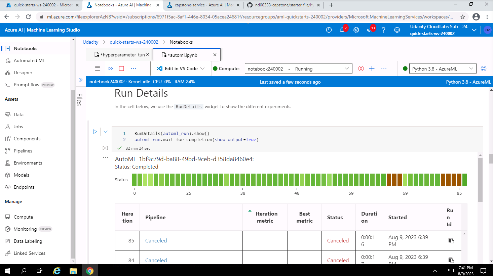

# Azure Machine Learning Engineer Capstone Project - machine learning in a heartbeat

This is the Azure Machine Learning Engineer Capstone Project, concluding the coursework. The project consists of
two distinct parts, centered around the prediction of (non-) survival of heart failure patients using data sourced from kaggle. 
The first part comprises a so-to-speak "manual" machine learning project approach, using the Azure ML framework and HyperDrive
to tune the parameters of a Gradient Boosting Classifier, selecting the best model. The second part consists of an AutoML
approach to the problem, using Auto ML framework provided by Azure. We then finally select, deploy, test and consume the 
endpoint of the best model from both approaches. 


## Project Set Up and Installation
This project requires the creation of a compute cluster in order to run the machine learning
experiments. Additionally, the dataset has to be uploaded and ingested manually. 

## Dataset

### Overview
For this project we use the [heart failure prediction dataset from Kaggle](https://www.kaggle.com/datasets/andrewmvd/heart-failure-clinical-data). This dataset contains records of medical data from 299 patients with heart failure, along with the (non-) survival of patients as a binary variable (`DEATH_EVENT`). 

### Task
The main task is to predict the (non-) survival of patients, using the dataset. The target variable or dependent variable is the binary `DEATH_EVENT` variable. The clinical features included in this dataset are: age, anaemia, creatinine_phosphokinase, diabetes, ejection_fraction, high_blood_pressure, platelets, serum_creatinine, serum_sodium, 
sex, smoking and time.

### Access
We manually downloaded and ingested the data from kaggle into Azure ML Studio, uploading
the csv and registering it as an Azure ML dataset, which then can be used via jupyter
notebook, or else. We first and foremost used access via jupyter notebook.

## Automated ML
The AutoML-approach aims towards automating the complete hand-crafted and thus brittle pipeline often used with hand-crafted ML-experiments. It includes data ingestion, feature engineering/learning, model training and hyperparameter selection all in one go. The used AutoML configuration considers the following aspects: 

- the `task` which is set to `classification`
- the `primary metric` used, which is set to `accuracy` according to our task
- the `training_data`, which is simply the Azure ML data asset described above
- the `label_column_name` of the target variable, which is the `DEATH_EVENT` column in the dataset
- the `n_cross_validations` is the number of cross-validation folds used to train and evaluate the models to get a better overview of the individual model's performances
- the `compute_target` to run our Auto ML job on, as described above
- the `enable_early_stopping`-flag to enable early stopping s.t. the experiment ends if the results do not improve satisfactorily
- the `experiment_timeout_minutes` - set to 20 minutes to enable us to act fast if the experiment gets stuck
- the `max_concurrent_iterations`, we allow 5 in order to not overload our compute
- we set up a `path` for storing the experiment results
- we set the `featurization` flag to "auto" to make full use of the AutoML - techniques for (pre-) processing our data
- and finally, we setup up a `debug_log` name for the Auto ML loggings


### Results
The best Auto ML experiment model is a Voting Ensemble, which consists of several scaling steps ad LightGBMClassifier, an XGBoostClassifier and a Rabndom Forest classifier. Here are the details on the ensemble:

```
Overview over the best model and its details: 

Pipeline(memory=None,

steps=[('datatransformer',
        DataTransformer(enable_dnn=False, enable_feature_sweeping=True, feature_sweeping_config={}, feature_sweeping_timeout=86400, featurization_config=None, force_text_dnn=False, is_cross_validation=True, is_onnx_compatible=False, observer=None, task='classification', working_dir='/mnt/batch/tasks/shared/LS_root/mount...

        PreFittedSoftVotingClassifier(classification_labels=array([0, 1]), estimators=[
        
        ('32', Pipeline(memory=None, steps=[('sparsenormalizer', Normalizer(copy=True, norm='l1')), ('xgboostclassifier', XGBoostClassifier(booster='gbtree', colsample_bylevel=1, colsample_bytree=1, eta=0.5, gamma=0.01, max_depth=7, max_leaves=15, n_estimators=100, n_jobs=1, objective='reg:logistic', problem_info=ProblemInfo(gpu_training_param_dict={'processing_unit_type': 'cpu'}), random_state=0, reg_alpha=0.5208333333333334, reg_lambda=2.291666666666667, subsample=1, tree_method='auto'))], verbose=False)), 
        
        ('36', Pipeline(memory=None, steps=[('sparsenormalizer', Normalizer(copy=True, norm='l2')), ('xgboostclassifier', XGBoostClassifier(booster='gbtree', colsample_bytree=0.5, eta=0.05, gamma=0.01, max_depth=6, max_leaves=3, n_estimators=600, n_jobs=1, objective='reg:logistic', problem_info=ProblemInfo(gpu_training_param_dict={'processing_unit_type': 'cpu'}), random_state=0, reg_alpha=1.6666666666666667, reg_lambda=2.0833333333333335, subsample=1, tree_method='auto'))], verbose=False)), 
        
        ('27', Pipeline(memory=None, steps=[('sparsenormalizer', Normalizer(copy=True, norm='l1')), ('xgboostclassifier', XGBoostClassifier(booster='gbtree', colsample_bytree=1, eta=0.4, gamma=0.1, max_depth=10, max_leaves=127, n_estimators=50, n_jobs=1, objective='reg:logistic', problem_info=ProblemInfo(gpu_training_param_dict={'processing_unit_type': 'cpu'}), random_state=0, reg_alpha=0.8333333333333334, reg_lambda=1.1458333333333335, subsample=0.8, tree_method='auto'))], verbose=False)), 
        
        ('41', Pipeline(memory=None, steps=[('robustscaler', RobustScaler(copy=True, quantile_range=[25, 75], with_centering=False, with_scaling=False)), ('gradientboostingclassifier', GradientBoostingClassifier(ccp_alpha=0.0, criterion='friedman_mse', init=None, learning_rate=0.1, loss='deviance', max_depth=1, max_features=0.6, max_leaf_nodes=None, min_impurity_decrease=0.0, min_impurity_split=None, min_samples_leaf=0.13894736842105262, min_samples_split=0.29105263157894734, min_weight_fraction_leaf=0.0, n_estimators=50, n_iter_no_change=None, presort='deprecated', random_state=None, subsample=0.7631578947368421, tol=0.0001, validation_fraction=0.1, verbose=0, warm_start=False))], verbose=False)), 
        
        ('34', Pipeline(memory=None, steps=[('sparsenormalizer', Normalizer(copy=True, norm='l1')), ('xgboostclassifier', XGBoostClassifier(booster='gbtree', colsample_bytree=1, eta=0.3, gamma=0, max_depth=10, max_leaves=3, n_estimators=100, n_jobs=1, objective='reg:logistic', problem_info=ProblemInfo(gpu_training_param_dict={'processing_unit_type': 'cpu'}), random_state=0, reg_alpha=0, reg_lambda=2.1875, subsample=0.5, tree_method='auto'))], verbose=False)), 
        
        ('42', Pipeline(memory=None, steps=[('standardscalerwrapper', StandardScalerWrapper(copy=True, with_mean=False, with_std=False)), ('lightgbmclassifier', LightGBMClassifier(boosting_type='goss', colsample_bytree=0.99, learning_rate=0.04211105263157895, max_bin=110, max_depth=4, min_child_weight=4, min_data_in_leaf=0.07931241379310346, min_split_gain=1, n_estimators=50, n_jobs=1, num_leaves=197, problem_info=ProblemInfo(gpu_training_param_dict={'processing_unit_type': 'cpu'}), random_state=None, reg_alpha=1, reg_lambda=0.894736842105263, subsample=1))], verbose=False)), ('11', Pipeline(memory=None, steps=[('minmaxscaler', MinMaxScaler(copy=True, feature_range=(0, 1))), ('randomforestclassifier', RandomForestClassifier(bootstrap=True, ccp_alpha=0.0, class_weight='balanced', criterion='gini', max_depth=None, max_features='sqrt', max_leaf_nodes=None, max_samples=None, min_impurity_decrease=0.0, min_impurity_split=None, min_samples_leaf=0.01, min_samples_split=0.33789473684210525, min_weight_fraction_leaf=0.0, n_estimators=200, n_jobs=1, oob_score=False, random_state=None, verbose=0, warm_start=False))], verbose=False))], flatten_transform=None, weights=[0.125, 0.125, 0.125, 0.25, 0.125, 0.125, 0.125]))],verbose=False)
```

The model has an `accuracy` of ~88% 

Interestingly, the Auto ML experiment did not reach an accuracy of > 90 %.
Hence, it might be interesting for the future - especially with such a small dataset - to investigate Auto ML [data synthetization approaches](https://ydata.ai/resources/top-5-packages-python-synthetic-data), which could
boost the accuracy and increase the amount of data to learn form. 

Run Details widget output:


Best Run ID and metrics (1-2): 


Best model details w. params:


## Hyperparameter Tuning
We use a Gradient Boosting Classifier here, because we are dealing with tabular data and have a binary variable as the target in our classification problem. This is an additive modeling approach, often providing very good performance, a lot of flexibility, can work with categorical and numerical values as-is and naturally handles missing data.

To tune and adapt the basic classifier, we are using HyperDrive to select the best hyperparameters which are here:

- the `learning_rate` (default: 0.1, we vary this by allowing `uniform(0.1, 0.5)` as a parameterization option)
- `n_estimators`, the number of base estimators (decision trees) used in the gradient boosting modeling process (we give a list to choose from: 100, 200, 300, 350)

We use a bandit early stopping policy, which halts the experiments if there is no more improvement in model accuracy, i.e. the model primary metric of the last run is no within the specified slack factor of the most successful run.

To progress through the hyperparameter search space (defined on n_estimators and the learning_rate) fast and easy, we use a random parameter sampler. This is bc. of its non-exhaustive nature, sampling suitable hyperparameters randomly.

To best track our experimentation success, we optimize for the best-possible `accuracy` (primary metric) w.r.t. the classification problem, to most accurately predict the (non-) survival of patient's based on their clinical data.

### Results
The best Gradient Boosting Classifier also reaches an accuracy of ~88% with its hyperparameters `learning_rate`=0.1064 and `n_estimators`=100. 

Although the accuracy seems competitive w.r.t. the Auto ML approach, it might be beneficial to provide other `subsample` - parameter values, which would allow the model's individual learner's to choose different samples from the dataset during training. Besides, a different metric, maybe taking into account how costly it is to misclassify the patients might be more suitable for the task at hand and provide additional insights into the models' performance.

Hyperdrive Run Details output (1-3):


Hyperdrive model best run id and metrics:


Hyperdrive best model details w. params:


## Model Deployment
We deployed the best model from the HyperDrive experiment as a web service endpoint and tested it with three randomly chosen samples from the dataset.


```
{"data": [
    {"age": 61.0, "anaemia": 0, "creatinine_phosphokinase": 582, "diabetes": 1, "ejection_fraction": 38, "high_blood_pressure": 0, "platelets": 147000.0, "serum_creatinine": 1.2, "serum_sodium": 141, "sex": 1, "smoking": 0, "time": 237}, 
    {"age": 66.0, "anaemia": 1, "creatinine_phosphokinase": 68, "diabetes": 1, "ejection_fraction": 38, "high_blood_pressure": 1, "platelets": 162000.0, "serum_creatinine": 1.0, "serum_sodium": 136, "sex": 0, "smoking": 0, "time": 95}, 
    {"age": 70.0, "anaemia": 0, "creatinine_phosphokinase": 212, "diabetes": 1, "ejection_fraction": 17, "high_blood_pressure": 1, "platelets": 389000.0, "serum_creatinine": 1.0, "serum_sodium": 136, "sex": 1, "smoking": 1, "time": 188}
    ]
}
```

Screenshot of the successful deployment loggings:


Screenshot of the deployed model test:


Screenshot of the healthy endpoint: 


## Screen Recording
https://youtu.be/R8emij85s8g